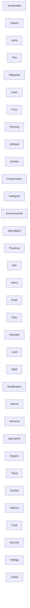

```mermaid
graph LR
    N0["Sustainable"]
    N1["August"]
    N2["Jump"]
    N3["This"]
    N4["Wikipedia"]
    N5["Learn"]
    N6["From"]
    N7["Farming"]
    N8["Artificial"]
    N9["Zambia"]
    N10["Conservation"]
    N11["Intelligent"]
    N12["Environmental"]
    N13["Agrivoltaics"]
    N14["Practices"]
    N15["Soil"]
    N16["Africa"]
    N17["Peak"]
    N18["Over"]
    N19["Improper"]
    N20["Land"]
    N21["Wadi"]
    N22["Modification"]
    N23["Almost"]
    N24["Intensive"]
    N25["Agriculture"]
    N26["Organic"]
    N27["There"]
    N28["Charles"]
    N29["Nations"]
    N30["Food"]
    N31["Security"]
    N32["Kellogg"]
    N33["United"]
```
