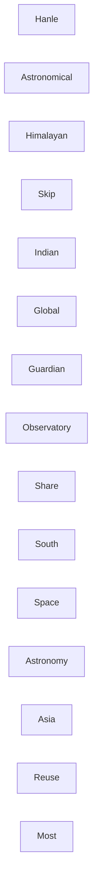

```mermaid
graph LR
    N0["Hanle"]
    N1["Astronomical"]
    N2["Himalayan"]
    N3["Skip"]
    N4["Indian"]
    N5["Global"]
    N6["Guardian"]
    N7["Observatory"]
    N8["Share"]
    N9["South"]
    N10["Space"]
    N11["Astronomy"]
    N12["Asia"]
    N13["Reuse"]
    N14["Most"]
```
