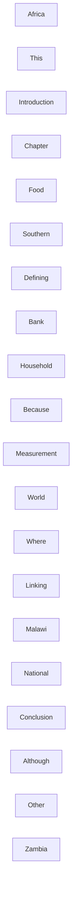

```mermaid
graph LR
    N0["Africa"]
    N1["This"]
    N2["Introduction"]
    N3["Chapter"]
    N4["Food"]
    N5["Southern"]
    N6["Defining"]
    N7["Bank"]
    N8["Household"]
    N9["Because"]
    N10["Measurement"]
    N11["World"]
    N12["Where"]
    N13["Linking"]
    N14["Malawi"]
    N15["National"]
    N16["Conclusion"]
    N17["Although"]
    N18["Other"]
    N19["Zambia"]
```
