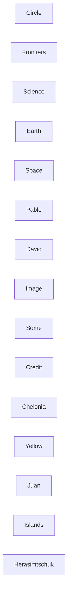

```mermaid
graph LR
    N0["Circle"]
    N1["Frontiers"]
    N2["Science"]
    N3["Earth"]
    N4["Space"]
    N5["Pablo"]
    N6["David"]
    N7["Image"]
    N8["Some"]
    N9["Credit"]
    N10["Chelonia"]
    N11["Yellow"]
    N12["Juan"]
    N13["Islands"]
    N14["Herasimtschuk"]
```
